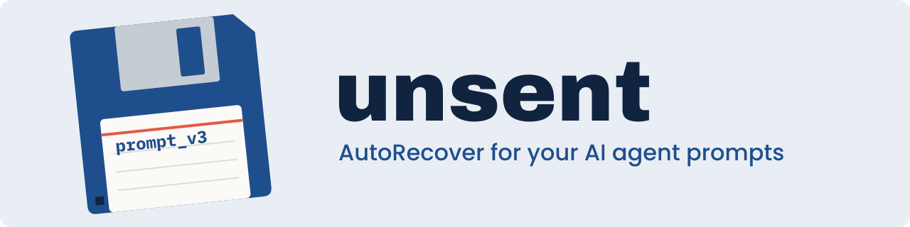

<p align="center">
  
</p>

<p align="center">
  <a href="https://github.com/GeiserX/unsent/actions/workflows/ci.yml"></a>
  <a href="https://codecov.io/gh/GeiserX/unsent"></a>
  <a href="LICENSE"></a>
</p>

# unsent

**AutoRecover for your AI agent prompts.**

Remember Word's AutoRecover? The laptop dies at 3 a.m. the night before the deadline, you reopen Word, and there it is on the left: *Document Recovery: thesis_FINAL_v3 (AutoRecovered)*. That little panel has saved more university projects than any all-nighter.

`unsent` brings that to the box where you type to Claude Code.

You spend ten minutes writing a careful prompt. Then the terminal window closes, the machine reboots for an update, Claude Code crashes, or you press Ctrl+C one time too many, and the prompt is gone. Claude Code saves your *conversations*, not the message you haven't sent yet. The request to change that, [anthropics/claude-code#18755](https://github.com/anthropics/claude-code/issues/18755), was closed as not planned.

With `unsent`, the next time you start Claude Code in that folder you see this line, before it starts and again after it exits, because Claude Code's screen covers the first one while it runs:

```text
unsent: recovered a draft from 18:42 today, 23 lines. Run `unsent restore` to copy it.
```

## Install

With Homebrew on macOS or Linux, available once the tap is live with v0.3:

```sh
brew tap GeiserX/unsent && brew trust GeiserX/unsent && brew install unsent
```

With Go:

```sh
go install github.com/GeiserX/unsent@latest
```

Or grab a binary for macOS or Linux from the [releases page](https://github.com/GeiserX/unsent/releases).

## Use

Start Claude Code through it:

```sh
unsent claude
```

Everything else stays the same. Same terminal, same keys, same arguments, so `unsent claude --resume` works too. To stop typing `unsent`, run setup once:

```sh
unsent setup          # from the next shell, `claude` runs through unsent
unsent status         # am I protected? one line per fact
unsent setup --undo   # remove the block again
```

Setup adds one marked block to `~/.zshrc` or `~/.bashrc`, picked from `$SHELL` (or `unsent setup bash`). It turns each agent `unsent` can read, today `claude`, into a shell function that runs it through `unsent`. An alias such as `alias claude='claude --model opus'` keeps working, and a function of the same name is left alone. An alias that points at a path, and launchers that start the agent through `env`, `command`, `exec` or a full path, skip the wrapper: setup warns about them and never edits them. `unsent status` asks a new shell what each agent name runs and what bypasses it, without starting an agent or editing a file. Run setup again after an upgrade that adds agents. `--undo` removes the block and nothing else, and your drafts stay. To uninstall, run `unsent setup --undo` and `brew uninstall unsent`.

To run the agent without `unsent` for a while, for example when an agent update confuses it, set `UNSENT_OFF=1`: `unsent` then hands over to the agent directly. `command claude` also skips the wrapper, for one run.

When the agent starts through a command that doesn't carry its name, such as `npx` or a renamed binary, name the agent: `unsent --as claude npx @anthropic-ai/claude-code`, or put the variable in front of that one command: `UNSENT_AGENT=claude unsent npx @anthropic-ai/claude-code`. Don't export `UNSENT_AGENT` in your shell profile: every wrapped command whose name unsent doesn't recognize would then be read as that agent.

After a crash, a closed window or a reboot:

```sh
unsent list          # drafts left behind, newest first
unsent restore       # copy the newest one to the clipboard, then paste it
unsent show 2        # print draft 2
unsent list --all    # also drafts you cleared or replaced
unsent list --here --agent claude   # only Claude Code's drafts from this folder
```

Each draft remembers the agent and the folder it came from. The notice only offers a draft back to that agent in that folder, and counts the ones left in subfolders. `unsent restore --agent claude` copies that agent's newest draft from this folder, and a number from `unsent list` reaches any draft.

## Sent messages

Every message you send goes to that session's sent log, in order, with its time and with pastes expanded. After you start a new session, the old one's messages are one command away:

```sh
unsent log                 # sessions with sent messages, newest first
unsent log 1               # every message sent in session 1
unsent log 1 --copy 3      # copy message 3 of it to the clipboard
unsent log --here --agent claude   # only Claude Code's sessions in this folder
unsent forget --log 20260927-101500-4242   # delete one session's sent log, by the id unsent log shows
```

`unsent forget --log` takes the session id, not the number: the numbers move when another session sends its first message.

A send and a clear both empty the box, and the key you pressed tells them apart. A draft counts as sent only when Enter was the last key before the box emptied, with no Ctrl+C or Esc Esc next to it, and the box was on screen when you pressed it. Typing the next message into the emptied box doesn't change that. When `unsent` can't be sure, it treats the draft as cleared and keeps it in history. A missed send costs one history entry, never text.

To keep nothing of what you send, set `UNSENT_ON_SEND=delete`. `UNSENT_ON_SEND_CLAUDE=delete` does the same for Claude Code alone, and wins over `UNSENT_ON_SEND`. Turning it off doesn't delete existing logs; `unsent forget --log` does.

## Works everywhere you type

`unsent` wraps the agent rather than the terminal, so it works in any terminal app. Ghostty, iTerm2, Terminal.app, Kitty, WezTerm, Alacritty, the VS Code and Cursor terminals, tmux and SSH sessions all work. You don't need tmux, a plugin or a config file.

| Agent | Status |
| --- | --- |
| Claude Code | Supported |
| Codex CLI, Gemini CLI | Planned: each needs a small reader for its input box |

Anything else runs through `unsent` unchanged; it just isn't saved yet.

## How it works

1. `unsent` starts the agent inside a pseudo-terminal and passes every byte through, untouched, in both directions.
2. It keeps a hidden copy of the screen and, every 0.4 seconds, reads the text in the agent's input box off it.
3. When the text changes, it writes it to disk: a temporary file, flushed with `fsync`, then renamed into place. A power cut leaves the previous save or the new one, never half a file.
4. When you send the box, the message goes to the session's sent log. When you clear it, the draft moves to history. When the agent exits with text still in the box, the draft stays for `unsent restore`.

**One promise.** `unsent` never throws away text you didn't delete. Text in view is read exactly. Text out of sight above or below the box is inferred, and an inference can be wrong, so while a draft is taller than the box every save that loses text first keeps the previous version. Whatever `unsent` gets wrong, a correct copy is in `unsent list --all`, marked "(earlier version)". Those copies are capped at 30 per session and deleted once the prompt is sent.

A few things make that more than a screenshot:

- **Long drafts.** Claude Code's box stops growing at half the window height and scrolls inside itself, so the screen only shows part of a long prompt. `unsent` lines each view up, word by word, against what it has already seen, and keeps the parts above and below it. Edits you make after scrolling back up, and resizing the window, both work. The screen can't tell text you deleted from text that only moved out of sight. The delete keys you pressed in the last second can, so `unsent` counts them.
- **Big pastes.** Claude Code shows a paste of 4 or more lines, or over 800 characters, as `[Pasted text #1 +39 lines]`. Terminals mark pasted text with special codes, so `unsent` records the paste as it goes in and puts the real text back in place of the placeholder.
- **Ctrl+Z.** Suspending works as usual: your shell shows the job as stopped, and `fg` brings the agent back.
- **Pipes.** When input or output isn't a terminal (`git diff | claude -p "review"`, `claude -p x > out.md`), `unsent` hands over to the agent directly. There's no input box to save, so the wrapper is safe to keep.
- **Saying when it didn't save.** Claude Code draws on a screen of its own, which hides anything printed while it runs, so `unsent` speaks up after the agent exits. If it never found the input box in a session you typed in, which is what an agent update that changes the box looks like, it says so and names the version it last checked, for example `unsent: could not read claude 2.1.290's box this session (last verified 2.1.282), nothing was saved`. An agent it has no reader for is named before it starts and again after it exits. If `unsent` itself hits a bug, it stops saving, keeps the last draft it saved and passes every byte through for the rest of the session. The agent never notices.
- **Knowing what's dead.** Each session holds a file lock, and the operating system releases it when the process dies, whether it exits, crashes or the machine reboots. A process ID can't be trusted for this because a reboot reuses them. The lock can.

## Where your drafts live

Drafts live in `~/.local/state/unsent/`. Set `XDG_STATE_HOME` or `UNSENT_HOME` to move them. `drafts/` holds one file per session, and `history/` keeps the last 500 drafts you cleared, replaced or restored, plus the capped earlier versions. `sent/` holds one sent log per session. A log over 5 MB drops its oldest messages first, logs not written to for 90 days are deleted, and at most 2,000 are kept. Only you can read the folder, which is mode `0700` with `0600` files. Drafts are plain JSON and never leave your machine, since `unsent` makes no network connections.

## Limits

- It only saves agents started through `unsent`. It can't see the Claude Desktop app or the VS Code extension's chat panel, which don't run in a terminal.
- Pasted images show as `[Image #1]` and come back as that placeholder. So does audio, as `[Audio #1]`.
- Claude Code shows a draft over 10,000 characters with its middle cut out, as `[...Truncated text #1 +137 lines...]`. `unsent` puts the middle back from the draft it saved just before, but only when the whole cut box, its first 500 characters, the placeholder and its last 500, fits on screen at once. That takes a tall window: in an 80 by 24 one it never does, and line breaks near either end make it harder. It also can't when an image sat in the cut middle, because Claude Code moves `[Image #N]` next to the cut. Otherwise it saves what the box shows and keeps the full draft in history.
- A screen can't tell a wrapped line from a line you ended by hand exactly where the row was full. In that one case the line break comes back as a space. Lines that start a list item, heading, quote or code block are kept on their own line.
- If a whole long draft lands in the box between two saves, only the part on screen is recovered. Typing never goes that fast.
- In a draft taller than the box, a few edits can't be read off the screen for certain: for example, typing a word identical to the next word hidden below the box, or typing, deleting and scrolling at the edge of the box within one 0.4-second save. Then the live draft can come out slightly wrong. In simulation that's about 1 save in 100 with ordinary text, a little more with heavily repeated words or with Ctrl+W. Thanks to the promise above, the correct text is still in history.
- A draft that changes wholesale, like a prompt recalled with the Up arrow, is saved from what's on screen, and the old draft goes to history.
- The sent log holds the box as Claude Code last drew it before your Enter. A key typed so fast before Enter that Claude Code never drew it can be missing. Only plain Enter counts as a send for now: Ctrl+Enter, a remapped submit key, or Enter in a keyboard mode that encodes it differently reads as a clear, and the message goes to history instead.
- Pressing Esc while Claude Code works on a message can put that message back in the box. The sent log still holds it, although Claude Code didn't answer it.
- macOS and Linux, including WSL. Native Windows has no pseudo-terminals of this kind.

## Development

```sh
go test -race ./...
```

The tests include a fake agent that draws its box the way Claude Code does. Typing, pasting, Ctrl+C, Ctrl+Z and a closed window all run end to end without Claude Code installed.

`unsent capture claude`, run from a checkout of this repo, records a test fixture: every key and all of the agent's output go to `testdata/claude/<version>/capture-<time>.rec`, the window sizes to a `.json` beside it, and each Ctrl+G saves the box as an editor copy instead of opening your editor. Setting `UNSENT_DEBUG_DIR=<folder>` logs the same keys and output there for any session, next to each save's view. Both are off unless you ask, and their files are `0600`, but they hold everything you type: check them before you share or commit them.

## License

[GPL-3.0](LICENSE)
