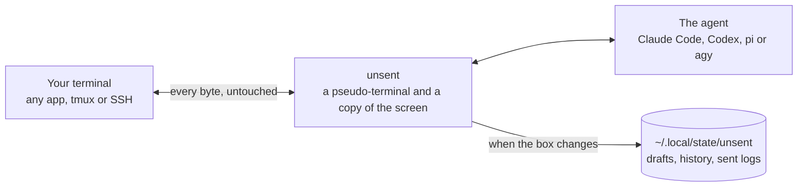

---
hide:
  - navigation
---

# unsent { .us-visually-hidden }

<p align="center">
  
</p>

<p align="center">
  <a href="https://github.com/GeiserX/unsent/releases"></a>
  <a href="https://github.com/GeiserX/unsent/stargazers"></a>
  <a href="https://github.com/GeiserX/unsent/actions/workflows/ci.yml"></a>
  <a href="https://github.com/GeiserX/unsent/blob/main/LICENSE"></a>
</p>

---

**unsent** saves the message you have typed into a coding agent and not sent yet, and gives it back after a closed window, a reboot, a crash or one Ctrl+C too many. Claude Code, Codex, pi and agy save your conversations, not the message still in the box. `unsent` runs the agent in your terminal as before, reads its input box every 0.4 seconds and keeps the text on disk; it saves your half-typed zsh command line too. Start with [Getting started](getting-started.md), then [Using unsent](usage.md). [Supported agents](supported-agents.md) says which version of each agent was last checked, and how.

<div class="grid cards" markdown>

-   :material-download: **[Getting started](getting-started.md)**

    ---

    Homebrew, Go or a release binary for macOS and Linux.

-   :material-play-circle-outline: **[First run](getting-started.md#first-run)**

    ---

    `unsent setup` once, `unsent status` to check, and the line you see after a crash.

-   :material-restore: **[Using unsent](usage.md)**

    ---

    Recovering drafts, the JSON output for scripts, the Claude Code hook, and what differs in Codex, agy and pi.

-   :material-format-list-bulleted: **[Configuration](configuration.md)**

    ---

    Every environment variable, what it does when unset, and how to turn `unsent` off for a while.

</div>

## After a crash

The next time you start the agent in that folder, `unsent` says what it kept, before the agent starts and again after it exits:

```text
unsent: recovered a draft from 18:42 today, 23 lines. Run `unsent restore` to copy it.
```

`unsent restore` copies the draft to the clipboard. Reopen the conversation you typed it in instead (`claude --resume`, `codex resume --last`, `agy -c`) and the draft goes back into the empty box on its own, with a line under it: `unsent: put back your draft from 18:42 today, not sent`. Nothing is sent for you.

## What it saves

- The agent's input box as you type, including a long draft that scrolls inside the box and a big paste the agent shows as a placeholder such as `[Pasted text #1 +39 lines]`.
- Drafts you cleared or replaced, in a history that `unsent list --all` shows.
- Every message you send, in a [sent log](sent-messages.md) per conversation (per run in pi), so an older session's messages are one command away. For Claude Code, each message can also carry its [context](context.md): the question it answered.
- Your half-typed [zsh command line](zsh.md), when a window closes or Ctrl+C clears it.

## How it runs



- `unsent` wraps the agent, not the terminal, so it works in any terminal app, in tmux and over SSH, with the agent's own keys and arguments.
- Each save goes to a temporary file, is flushed with `fsync` and renamed into place, so a power cut leaves the previous save or the new one, never half a file.
- `unsent setup` adds one block to your shell's rc file so `claude`, `codex`, `pi` and `agy` run through `unsent` from the next shell. [How it works](how-it-works.md) has the whole mechanism.

## What it does not do

- It never sends anything for you. A draft goes back into an empty box or to the clipboard, and you decide.
- It can't see agents that don't run in a terminal, such as the Claude Desktop app or the VS Code extension's chat panel.
- An agent it has no reader for runs through it unchanged and nothing is saved; `unsent` says so before the agent starts and after it exits.
- It runs on macOS and Linux, including WSL, not on native Windows.
- Text scrolled out of sight in a tall draft is inferred, and an inference can be wrong; the correct copy then waits in history. [Limits](limits.md) lists every case.

## Privacy

Drafts and sent logs are plain JSON under `~/.local/state/unsent/`, in a folder only you can read (`0700`, files `0600`). `unsent` makes no network connections. The optional Claude Code hook passes Claude the first line of a kept draft, cut to 100 characters, and nothing more. To add [context](context.md) to sent messages, `unsent` reads Claude Code's transcripts, but only your own turns and the agent's text right before each one, and writes only to its own folder. [Configuration](configuration.md) says how to move the folder or keep nothing of what you send.

## Getting help

- After an agent update `unsent` says `could not read claude 2.1.290's box this session (last verified 2.1.282), nothing was saved`: the agent changed its box. Set `UNSENT_OFF=1` until a release reads it, and open an issue with both versions.
- `unsent status` lists a launcher that bypasses the wrapper: [Using unsent](usage.md) says which launchers skip it and how to name the agent with `--as`.
- Something else: open an [issue](https://github.com/GeiserX/unsent/issues). A security problem goes through the [security policy](https://github.com/GeiserX/unsent/blob/main/SECURITY.md), never a public issue.
- Running the tests and recording a fixture from a real agent: [Development](development.md).

## License

unsent is released under the [GPL-3.0-or-later](https://github.com/GeiserX/unsent/blob/main/LICENSE) license.
